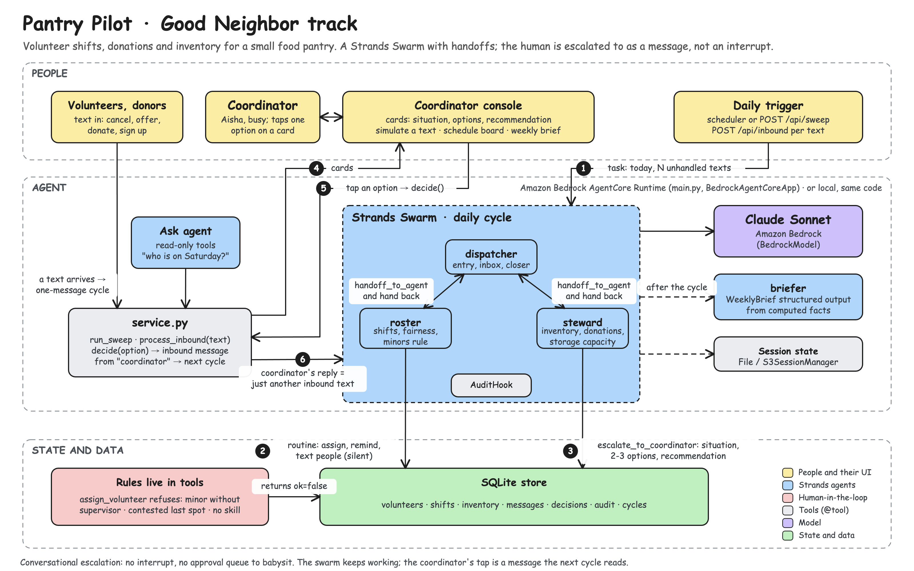
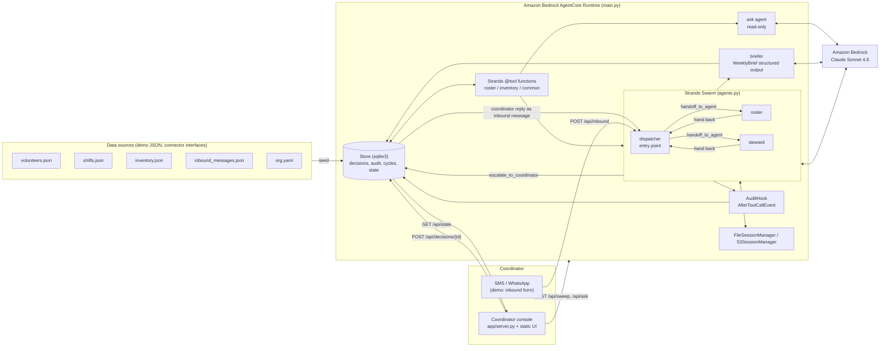

# Pantry Pilot

A coordinator's assistant for community food pantries: fills shifts, tracks donations, answers volunteers, and escalates only real conflicts.

Built for the AWS "Agents for Humans" hackathon, Good Neighbor Agents track, on Strands Agents and Amazon Bedrock AgentCore.

## The problem

Small food pantries and mutual-aid groups run on one or two volunteer coordinators. Their evenings go to logistics: texting to fill Saturday's intake desk after two cancellations, remembering who is trained on the forklift or the intake desk, telling a donor when to drop off 40 lbs of rice, noticing that size 4 diapers are almost out, and sending reminders so the shifts that are covered stay covered.

None of this is hard. It is relentless, it happens on a phone at 9pm, and coordinator burnout is one of the main reasons small pantries shrink or close. Feeding America's network alone counts tens of thousands of partner agencies, most of them small and heavily dependent on volunteers, and each one has someone doing this job by hand.

The routine part (schedule lookups, fair replacement search, drop-off windows, reminders) is exactly the part software can carry. The judgment calls (two people want one slot, a donation that may not fit, anything involving a minor) should stay with a person, and the interruption should be a short question, not a dashboard.

## Who it's for

Volunteer coordinators at small food pantries, community fridges, mutual-aid groups, church and school pantries. Secondarily their volunteers and donors, who get an answer in minutes instead of the next evening.

## What the agent does

Two triggers:

- **Inbound messages** (SMS/WhatsApp-style; in the demo they arrive through `POST /api/inbound` or the AgentCore `inbound` action): volunteers ("can't make Saturday", "I'm free Tuesday evenings now", "is the 10am shift still on?"), donors ("40 lbs of rice, when can I drop off?"), partner organisations ("can you take 30 frozen turkeys Friday?"), and the coordinator's own replies to escalations.
- **Daily cycle** (`sweep`): looks 7 days ahead at open slots, unconfirmed volunteers, under-par inventory and expiring stock, sends reminders and asks, and writes a structured `WeeklyBrief`.

**Handles alone:** answering volunteer questions from the schedule; processing a cancellation and asking the best replacement 1:1 (availability, required skills, fairness: fewest shifts in the last 30 days, then reliability); confirming a swap; logging a donation and proposing a drop-off window inside open hours; day-before reminders; flagging below-par items; drafting (not sending) a donor "most needed" ask.

**Escalates to the coordinator:** two volunteers claim one slot and neither yields; a shift within 24h is still short after two rounds of asks (run short / cancel / coordinator covers); a donation the pantry may not be able to store; anything touching minors or the safety rules in `org.yaml`; a broadcast to all volunteers (gated); a purchase over $50 (gated). Every escalation carries the situation in 2-3 sentences, 2-3 concrete options, and a recommendation with the reason.

**Walk-through (the seeded demo, Friday 2026-09-11):** seven texts arrived this morning. Dana cancels tomorrow's 9am intake; Priya and Marcus both offer to take Saturday 9am; Linda has 40 lbs of rice and 20 cans of beans; Riverside Church offers 30 frozen turkeys; Sam, 16, asks for Tuesday 4pm; Jorge asks if Thursday's delivery run is on and offers to drive. One daily cycle: the `dispatcher` reads the queue and hands the people questions to `roster` and the goods questions to `steward`. `roster` confirms Jorge as Thursday's driver and texts him, finds that Saturday intake has exactly one open spot and two qualified volunteers, and escalates with "Priya (fewer recent shifts)" as the recommendation; it checks Tuesday's roster for a supervisor before answering Sam. `steward` logs Linda's donation, proposes Saturday 9-10am, and checks the chest freezer: room for about 10 turkeys, so it escalates with accept 10 / decline / borrow a freezer. `dispatcher` sends tomorrow's reminders, marks messages handled, and the cycle ends with the brief. The coordinator sees three cards, taps "Give Saturday 9am intake to Priya", and the next cycle confirms Priya, thanks Marcus as first alternate, and updates the board.

## Demo

Video: _link to be added_.

Three-minute local demo (needs Bedrock credentials, see "Run locally"):

```bash
make seed
SWEEP_INTERVAL_SECONDS=0 make serve      # http://localhost:8000
```

Click **Run daily cycle**, answer the cards in **Needs you**, then use **Simulate incoming text** (for example Helen: "Yes I can supervise Tuesday"). `./scripts/demo.sh` runs the same story in the terminal; `./scripts/demo.sh --dry-run` prints the steps without calling a model. The shot list is in [docs/demo-script.md](docs/demo-script.md).

## Architecture





More detail in [docs/architecture.md](docs/architecture.md).

## How it uses Strands Agents

- **`Swarm`** of three specialist `Agent`s (`dispatcher`, `roster`, `steward`) with `entry_point=dispatcher`, `max_handoffs=12`, `max_iterations=16`, repetitive-handoff detection, and a shared session manager: `src/pantrypilot/agents.py` (`build_agents`, `build_swarm`, `SWARM_CONFIG`). Agents hand off with the Swarm's built-in `handoff_to_agent(agent_name, message, context)` tool.
- **`@tool` functions** with precise docstrings, 24 of them, receiving the calling `agent` to read `agent.state["cycle_id"]` and `agent.state["approved"]`: `src/pantrypilot/tools/common.py`, `roster.py`, `inventory.py`; grouped per agent in `tools/__init__.py`.
- **Hooks**: `AuditHook(HookProvider)` subscribes to `AfterToolCallEvent` and writes one audit row per tool call tagged with `event.agent.name`: `src/pantrypilot/hooks.py`. `SwarmResult.node_history` is stored per cycle as the handoff trail: `src/pantrypilot/service.py` (`_run_cycle`).
- **Structured output**: `WeeklyBrief` (Pydantic) produced with `Agent(..., structured_output_model=WeeklyBrief)` and merged with deterministically computed facts: `src/pantrypilot/brief.py`.
- **Sessions**: `FileSessionManager` under `.data/sessions` locally, `S3SessionManager` when `SESSION_BUCKET` is set: `src/pantrypilot/sessions.py`.
- **Models**: `BedrockModel` (`global.anthropic.claude-sonnet-4-6`, `us-west-2`) with an optional `AnthropicModel` fallback for laptops without AWS: `src/pantrypilot/model.py`.
- **Agent state as a capability flag**: `build_approved_executor` creates a `dispatcher` with `state={"approved": True}` and `service.decide` calls `executor.tool.send_broadcast(...)` directly, no model in the loop: `src/pantrypilot/agents.py`, `src/pantrypilot/service.py`.
- **Read-only `Agent`** (`agent_id="pantrypilot-ask"`) for questions: `build_ask_agent`.
- **System prompts as product logic**, one per agent with the routine, the escalate/handle-alone rules and message tone: `src/pantrypilot/prompts.py`.
- **Deterministic testing**: `tests/scripted_model.py` implements `strands.models.Model` with Bedrock-shaped stream events, so the Swarm, hooks, tools and structured output are exercised offline.

## Human-in-the-loop design

A pantry coordinator lives in a messaging app, not in an admin panel. Blocking the agent mid-run with an interrupt would mean the whole daily cycle waits for a tap that may come three hours later, and a separate "approval queue" is one more inbox to check. So escalation is conversational:

1. An agent calls `escalate_to_coordinator(summary, options, recommendation)`. The tool only writes a `decisions` row; the swarm keeps working on everything else.
2. The console renders the row as a card: situation, one button per option, the recommendation highlighted, and a free-text box for anything else.
3. `service.decide` turns the tap into an inbound message from `coordinator` ("Coordinator decided on D-0001 (...): Give Saturday 9am intake to Priya"). The next cycle reads it like any other text and carries it out, including telling Marcus he is first alternate.

Gated actions (`send_broadcast`, `place_supply_order` over the threshold) use the same card with Approve / Decline. The tool stores its exact payload in the decision; on approval `service.decide` executes that payload with a direct tool call on an agent constructed with `approved=True`, so what the coordinator approved is exactly what goes out. Nothing is written to the outbox until then. Every step, human or agent, lands in the audit trail with a name on it.

## Run locally

Prerequisites: Python 3.12, [`uv`](https://docs.astral.sh/uv/), an AWS account with **Anthropic Claude model access enabled in the Amazon Bedrock console** (us-west-2, `global.anthropic.claude-sonnet-4-6`), and credentials in the default chain (`aws login`, `aws configure`, or `AWS_PROFILE`).

```bash
git clone <this repo> && cd pantry-pilot
make venv                 # uv venv -p 3.12 .venv && uv pip install -e ".[dev]"
cp .env.example .env      # optional; defaults work
make seed                 # loads data/*.json into .data/pantrypilot.sqlite3
make test                 # 33 offline tests, no AWS needed
make serve                # http://localhost:8000
```

CLI over the same service functions:

```bash
.venv/bin/python -m pantrypilot.cli status
.venv/bin/python -m pantrypilot.cli sweep
.venv/bin/python -m pantrypilot.cli inbound --from V-04 "Is the Thursday run still on? I can drive"
.venv/bin/python -m pantrypilot.cli decide D-0001 "Give Saturday 9am intake to Priya"
.venv/bin/python -m pantrypilot.cli ask "who is on Saturday morning?"
```

Environment variables (all optional, see `.env.example`): `BEDROCK_MODEL_ID`, `AWS_REGION`, `DEMO_TODAY` (default `2026-09-11`), `SWEEP_INTERVAL_SECONDS` (default 900, 0 disables), `SWEEP_ON_START`, `SESSION_BUCKET`, `MODEL_PROVIDER=anthropic` + `ANTHROPIC_API_KEY` for the non-AWS fallback.

## Deploy to Amazon Bedrock AgentCore

```bash
npm i -g @aws/agentcore
# edit agentcore/aws-targets.json: replace <ACCOUNT_ID> with your 12-digit account id (region us-west-2)
make deploy               # cd agentcore && agentcore validate && agentcore deploy -y
agentcore invoke '{"action": "status"}'
```

Then point the console at the runtime:

```bash
AGENT_BACKEND=agentcore AGENT_RUNTIME_ARN=arn:aws:bedrock-agentcore:us-west-2:<ACCOUNT_ID>:runtime/PantryPilotAgent-xxxx make serve
```

Notes: `agentcore/agentcore.json` uses `codeLocation: "../"` so the zip contains `main.py`, `src/`, `data/` and `requirements.txt` from the repo root. If your CLI version rejects a parent path, move `agentcore.json` and `aws-targets.json` to the repo root with `codeLocation: "."`. The runtime's `PANTRYPILOT_STATE_DIR` is `/tmp/pantrypilot`, so the SQLite store is per container; set `SESSION_BUCKET` for durable Swarm sessions and swap `Store` for DynamoDB for durable decisions. A `Dockerfile` (ARM64, non-root, port 8080) is included for the container build path.

Payload contract (`main.py`): `{"action": "sweep"}`, `{"action": "inbound", "from": "V-04", "text": "..."}`, `{"action": "decide", "decision_id": "D-0001", "response": "yes|no|<text>", "edits": {}}`, `{"action": "ask", "prompt": "..."}`, `{"action": "status"}`, `{"action": "state"}`. Unknown actions and exceptions return `{"ok": false, "error": "..."}`.

## Project structure

```
main.py                      AgentCore entrypoint (BedrockAgentCoreApp, action dispatch)
app/server.py                FastAPI console API + background scheduler
app/static/                  index.html, app.js, styles.css (no build step)
src/pantrypilot/
  agents.py                  Agents, Swarm, ask agent, approved executor
  prompts.py                 System prompts
  tools/                     common.py, roster.py, inventory.py, _ctx.py
  ranking.py                 Candidate ranking rules
  hooks.py                   AuditHook
  brief.py                   WeeklyBrief + facts
  service.py                 run_sweep, process_inbound, decide, ask, status, state_snapshot
  store.py                   sqlite3 Store
  seed.py, cli.py            Seeding and CLI
  model.py, sessions.py      BedrockModel / session manager factories
  backend.py                 LocalBackend, AgentCoreBackend
  config.py                  Paths, demo clock, logging
data/                        org.yaml, volunteers, shifts, inventory, contacts, inbound queue, coordinator replies
agentcore/                   agentcore.json, aws-targets.json
scripts/                     demo.sh, deploy_agentcore.sh
docs/                        architecture.mmd/.md, submission.md, demo-script.md, decisions.md
tests/                       scripted_model.py + 33 tests
```

## Data and connectors

Everything under `data/` is invented demo data for one pantry (14 volunteers, 8 shifts over the next 10 days, 18 inventory items, 7 inbound texts, 4 contacts). `pantrypilot.seed` loads it into SQLite; nothing calls an external service. Messages are written to an outbox table rather than sent. The `send_message` / `send_broadcast` tools and the `inbound` action are the seam where Twilio (SMS/WhatsApp) would plug in; roster and inventory reads go through `Store` so a Google Sheets, Airtable or DynamoDB implementation can replace `store.py` without touching the tools. None of those integrations are implemented.

## Roadmap

- Twilio inbound webhook and outbound sender behind the existing `send_message` interface; quiet-hours queue flush.
- DynamoDB `Store` and `S3SessionManager` by default when deployed.
- AgentCore Memory for volunteer preferences that should persist across cycles.
- Spanish replies for volunteers whose preferred language is Spanish (skill data is already there).
- Volunteer self-service by text: "my shifts", "swap with Priya".
- Second round of asks and the run short / cancel / coordinator covers escalation for shifts still short at T-24h.

## License

Apache-2.0. Copyright 2026 Ritwika Kancharla. See [LICENSE](LICENSE).
